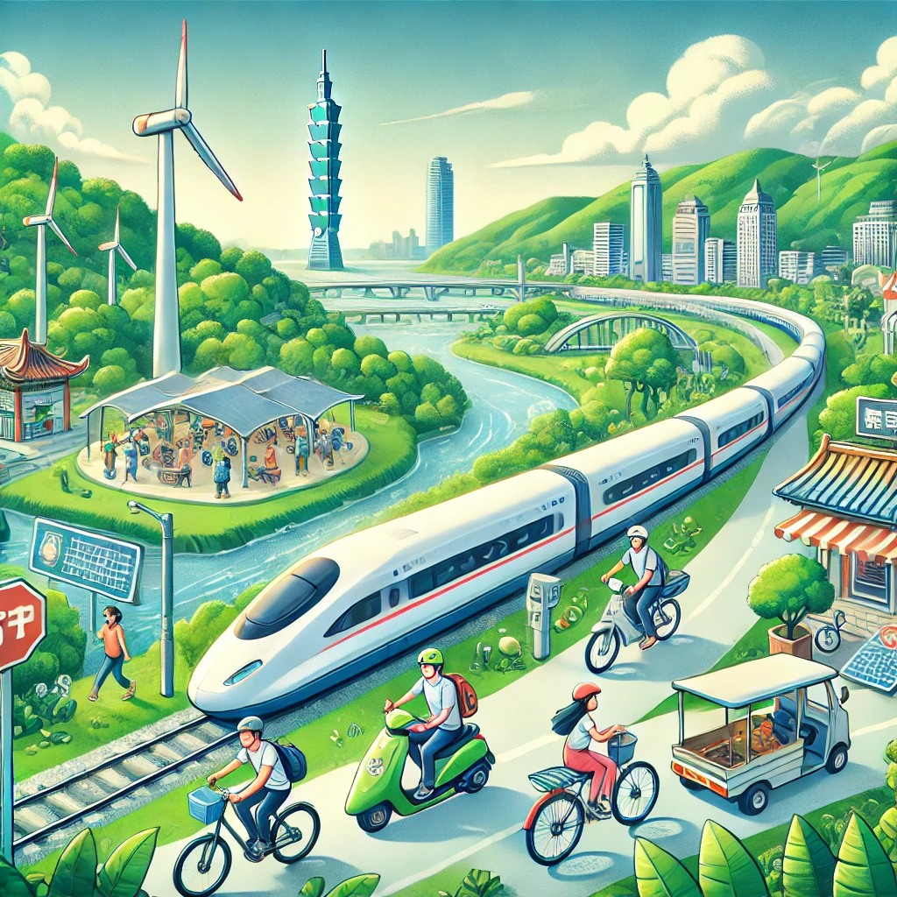

# 旅遊減碳
## [上一層](../README.md)
## 1. 低碳旅行：環保旅行方式探索

**低碳旅行**是指在旅行過程中採取*減少碳排放*的行為和選擇，以減輕對環境的負擔。\
***這種旅行方式強調使用公共交通、選擇綠色住宿、支持可持續旅遊活動，以及減少資源浪費。***\
旅行者可以選擇搭乘<ins>火車</ins>、<ins>電動車</ins>或<ins>共享交通工具</ins>，取代傳統的飛行和自駕遊；\
同時選擇那些推動環保理念的<sup>酒店</sup>和<sub>餐廳</sub>，並且尊重當地生態環境，減少不必要的能源消耗。\
透過這些簡單的改變，每位旅遊者都能為保護地球出一份力，享受綠色旅行的樂趣。
## 2. 綠色旅行：選擇可持續旅遊選項
當談到`綠色旅行`時，選擇可持續旅遊選項是`減少環境`影響的關鍵。\
隨著全球`氣候變遷`問題日益嚴重，\
```
越來越多的旅行者開始關注他們的旅行對環境的影響。
綠色旅行強調減少碳足跡、保護自然資源以及支持當地社區的發展。
```
```python=
a = 1
print(a)
```
## 3. 電動車與公共交通在旅遊中的運用
## 4. 可持續酒店：綠色住宿的選擇與挑戰
## 5. 減碳旅行：從航空公司到目的地的綠色選擇
## 6. 步行與騎行：最環保的旅遊方式
